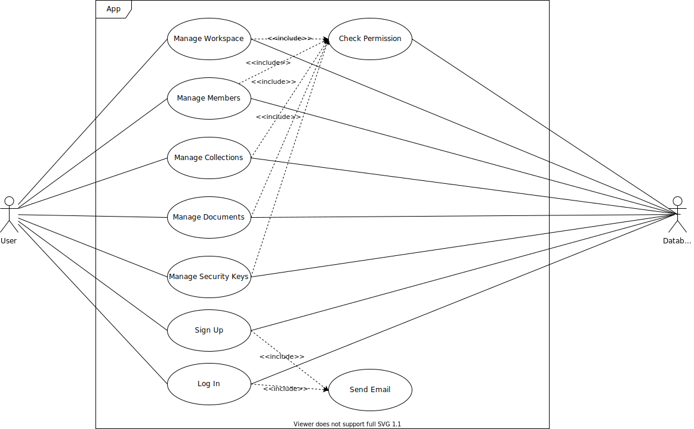

# Introduction
## Introduction

The world has been seeing a continuous shift to remote work since the internet boom in the early 2000s. The recent global pandemic instantly boosted the number of remote workers to unprecedented levels. On top of that, businesses have been gradually moving away from brick-and-mortar stores to online software-managed ones. Furthermore, client-side web apps and no-code web apps and websites have experienced a surge in the number of users. These factors uncovered a gap in the niche of easy-to-use collaborative data and content management software.

## Preliminary study

In order to better understand users' needs, we have to explore the existing solutions and their shortfalls.

### Existing solutions

A plethora of solutions in the niche of data and content management software exist today, with each having its own focus and its own distinctive use.

#### Notion.so

Notion is a new contender in the space of content management. It presents itself as a collaborative workspace for teams. Its use cases vary from product management and team documentation to note-taking and personal organization. The initial version of Notion was released in 2016. The second version, which received a lot of praise and media coverage, was released two years later in 2018. However, the largest surge in signups happened during the pandemic, with 40% of signups occurring from December 2020 to January.

Notion.so is built on the concept of blocks: A block is any single piece of content you add to your page, like a to-do item, an image, a code block, an embedded file, etc. ^[citation needed, see Notion FAQ] This makes it easy to build complex pages and move content around.

Notion is also built as a collaborative web app—eliminating the need for saving and figuring out how to share one's documents as is the case in other apps. 

Pricing is done per workspace member with unlimited storage starting from the free plan.

#### Airtable

Airtable is a visual database app inspired by the ease of spreadsheets and the wide adoption of software like Microsoft Excel. The company behind the app was founded in 2012.

Airtable comes with team collaboration out of the box. It also automatically generates a REST API from each database.

Pricing is done per team member. There are several limits to the size of storage and uploads.

#### Contentful

Contentful is a headless^[Content is decoupled from the main application. It's made accessible through a set of APIs.] CMS (Content Management Software). It offers a flexible CMS editor and a configurable API. It also comes with multiple SDKs (Software Development Kits) in multiple programming languages to make its integration easier. 

Pricing is offered per package, with the lowest premium package starting at US$489 per month.

#### Sanity.io

Sanity.io is another headless CMS. It competes directly with Contentful, offers an even more configurable editor, and its pricing starts at US$199 per month. It comes with real-time collaboration, a feature that Contentful lacks.

#### Webflow CMS

Webflow is a website builder. It bundles a CMS and an e-commerce management system along with its visual website builder. The CMS is not usable outside of Webflow websites, however, it comes with an intuitive user interface.

#### Firebase

Firebase is a platform developed by Google for creating mobile and web applications. It was initially released in 2012. It offers, among its products, a real-time database. In which, data is stored in JSON format and synced between all the connected clients. The database was not developed with non-technical users in mind, however, its real-time capabilities offer an example of what's desired in real-time database software. Firebase Realtime Database has been successfully used to develop highly demanding mobile applications.

### Critique

Multiple solutions are trying to focus on various use cases, however, all of them suffer from noticeable performance issues, a bad UX (User Experience), and inadequate pricing for small and medium-sized businesses.

Notion is known for its slow performance and long loading times. Pages take on average between six and 12 seconds to load. ^[citation needed] It also doesn't have an API, although one is being developed at the time of writing. Furthermore, Notion is less structured than products like Airtable or Firebase.

Airtable is notable for its complexity, even for experienced users. It also suffers from some performance issues when loading large documents. Furthermore, it doesn't have the same rich text capabilities as Notion. Finally, it lacks a real-time API and it's relatively expensive.

### Proposed solution

Merebase is a collaborative visual database that can be used for data and content management. It's built with real-time collaboration, performance, and intuitiveness in mind. Thanks to years of innovation in the field of browser apps and high-performance real-time servers, it should be able to load instantaneously, while offering a smooth user experience with no glitching or slowdowns when loading large documents, and with the ability to effortlessly collaborate with other users.

## Conclusion

The recent changes in workplaces and software development require robust collaborative and intuitive visual database systems, which we currently lack. Merebase is a proposed solution for these problems, built on top of cutting-edge technologies to offer the best user experience possible.

# Analysis and specification of needs
## Introduction

Researching the current solutions led us to formulate a set of requirements to ensure that Merebase offers the best experience.

## Functional requirements

- A user must signup and login using only their email
- A user's account picture is fetched automatically from Gravatar
- A user can create a maximum of 20 workspaces ^[This is a technical limit imposed by Stripe, the payment processor]
- A user can invite other users to their workspace using their email
- A user can create new projects, columns, and rows
- A user can query the database using a REST endpoint and a Websocket endpoint
- A user can upgrade their account to a premium one
- A user can cancel their premium subscription
- A user can edit the same document as other users at the same time
- A user can define the column data type (text, number, boolean, etc.)

## Non-functional requirements

- The web app should load within milliseconds
- Browsing large documents should not result in glitches or lags
- The interface should be accessible and intuitive
- Private documents should remain private and inaccessible to hackers
- The web app and the real-time server should be always available

## Identification of actors

Merebase uses RBAC (Role-Based Access Control) to manage users' access levels and permissions. There is only one actor, the user, but with multiple assignable roles.

* Owner: The user who created the resource, be it the workspace or the project. This role gives you entire access to the resource and it is assigned automatically.
* Admin: This role gives non-owner users the same privileges as the owner. Admins can invite new users and assign roles.
* Editor: This role permits a user to edit documents in a workspace.
* Viewer: This role permits a user to view documents in a workspace, without the ability to modify them.

## Use case diagrams

To better illustrate the main interactions between the user and the application, we rely on a use case diagram.

## Conclusion

_TBD_

